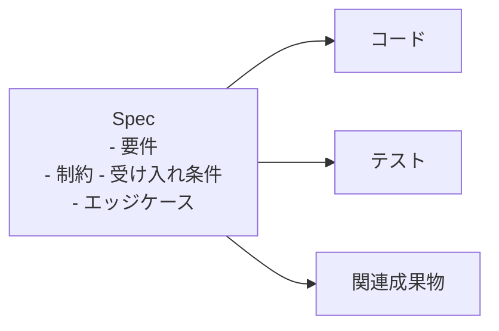

# Spec-driven development with AI

# 🧭 Spec-Driven Development（仕様駆動開発）
― Spec（仕様）を “Source of Truth” にする開発思想

## 1. SDDとは何か（ひとことで）
Spec-Driven Development（SDD）は、「まずコードを書く」のではなく「まず意図（intent）を明確にする」開発アプローチです。SDDは spec-first（仕様優先）のアプローチであり、チームは共通のガードレール・要件・制約・受け入れ基準・エッジケースを前もって定義し、その共有コンテキストからAIにコード・テスト・関連成果物を生成させます。 

従来の「思いつきでAIに指示する（vibe coding）」では、ゴールを伝えてコードを受け取っても、一見正しく見えて実は動かない、ということが起こりがちで、手早いプロトタイプには良くても、ミッションクリティカルなアプリや既存コードベースでは信頼性に欠けます。 

## 2. なぜ今SDDなのか ―「意味の喪失（Translation Loss）」
AIは開発を速くしましたが、速さだけでは良い結果を保証しません。AIネイティブ開発を採用するとき、本当の課題は、要件・設計・実装・検証を整合させ続け、最終成果が当初の意図を反映したものであり続けるようにすることです。 

問題はコード品質ではなく、アイデアが受け渡されるたびに「意味」が失われることです。ステークホルダーのニーズ→要件、要件→アーキテクチャ/設計、設計→実装、実装→検証/リリース。意図を保持する共有成果物がなければ、すべての受け渡しが“解釈”のステップになってしまいます。 そして AIはそれらのステップを加速できても、そもそも解消されなかった曖昧さを修正することはできません。

## 3. 核心思想 ― 「コード」ではなく「意図」がSource of Truth
SDDの最も重要な転換点はここにあります。

"We're moving from 'code is the source of truth' to 'intent is the source of truth.'" — Den Delimarsky, GitHub Blog 

AIによって、仕様（spec）こそがSource of truthとなり、何が作られるかを決定します。 これは ドキュメントが重要になったからではなく、AIが仕様を「実行可能（executable）」にしたからです。

### なぜコードをSource of truthにしてはいけないのか： 

何を・なぜ作るのかを事前に決めなければ、コードベースが事実上の仕様になり、それは寄せ集めで保守・進化・デバッグが難しいものになります。
コードは要件交渉の媒体として最適ではなく、本質的に「拘束力のある成果物」であり、一度実装すると切り離すのが非常に困難です。
だからこそ仕様を 「思考のバージョン管理（version control for your thinking）」 として扱います。SDDとは、技術的な意思決定を明示的・レビュー可能・進化可能にすること。重要な設計判断をメール・散在文書・誰かの頭の中に閉じ込めるのではなく、その“なぜ”を、プロジェクトと理解の深化に合わせて成長できる形で捉えるのです。

## 4. Specは「生きた・実行可能な成果物」
SDDのSpecは、書いて棚にしまう静的なドキュメントではありません。 

仕様を、プロジェクトとともに進化する“生きた・実行可能な成果物”として捉え直す。仕様が共有のSource of truthになります。
意味が通らないときは仕様に立ち返り、複雑になれば仕様を洗練させ、タスクが大きすぎれば分解する。 

Specはコードと並走して進化する生きた文書であり、正しく運用すれば、仕様を更新することがコードのリファクタリングと同じくらい自然な行為になります（コードには一切触れずに）。
仕様がコードから切り離されているからこそ、実装を固定せずに実験できる点も大きな利点です。仕様はコードから独立しているため、複数バリアントの実装を容易に作れます。RustとGoの性能差が気になるなら、同じ仕様から2つの実装をAIに作らせればよいのです。

## 5. 実践の考え方 ―「整合してから、加速する」
SDDの基本姿勢は 「先にプロンプトを打って後で帳尻を合わせる」のではなく、まず整合させ、明確な仕様からAIに実行を加速させること。エンジニアリングのライフサイクルはシンプルです： 

| フェーズ | 何をするか |
| --- | --- |
| 意図の定義 | 要件・シナリオ・受け入れ基準を捉える |
| 曖昧さの解消 | 曖昧さ・依存関係・エッジケースを解決する |
| 計画 | 意図をアーキテクチャ・フロー・制約へ翻訳する |
| タスク分解 | 実装可能な単位に分割する |
| 実装 | AIを使ってコードとテストを生成・洗練する |
| 検証 | 出力が仕様に一致しているかを検証する |

ここでの人間の役割は「操縦」だけでなく「検証」です。AIが成果物を生成し、あなたがそれが正しいことを保証する――各フェーズに明示的なチェックポイントを置き、次へ進む前にギャップを見つけて軌道修正します。 

## 6. 仕様＝自然言語というプログラミング言語
意図を“実装より優先”する発想を突き詰めると、仕様そのものがソースコードになります。

> "Treat the english language as a programming language." — Tomas Vesely, GitHub Blog 
> https://github.blog/ai-and-ml/generative-ai/spec-driven-development-using-markdown-as-a-programming-language-when-building-with-ai/

あるエンジニアは アプリのコードをMarkdownで書き、GitHub CopilotにGoへ“コンパイル”させ、結果としてGoコードを直接編集・閲覧することはほとんどなくなったと報告しています。開発ループは 
- 仕様を編集 → 
- AIにコードへコンパイルさせる → 
- 実行・テスト 
- → 期待通りでなければ仕様を更新 
- → 繰り返し。

ただし難しさは“書くこと”ではなく“決めること”にあります。MarkdownでのコーディングはGoを直接書くより難しいこともあり、何が欲しいのかを明確に記述する必要があります――それはソフトウェア開発で最も難しい部分かもしれません。

## 7. 最も大事な原則 ― Spec quality = Output quality
> "Spec quality = output quality." — Apoorv Gupta, Microsoft for Developers 
> https://developer.microsoft.com/blog/spec-driven-development-ai-native-engineering

成果の品質は仕様の品質と密接に結びついています。要約すれば、仕様の品質＝出力の品質です。 仕様駆動でもテストは不可欠で、仕様は意図された振る舞いを記述しますが、それを検証するのはテストです。 

## 8. 導入のヒント（小さく始める）
チームはSDDのライフサイクル全体を一度に採用する必要はなく、小さく焦点を絞ったパイロットが、実践で何が効くかを学ぶ最良の方法です。 

- Pilot — 整合性の問題が見えている1つの機能・ワークフローから始める
- Formalize — シナリオ・制約・受け入れ基準を捉えた軽量な仕様を作る
- Iterate — その共有コンテキストからAIに実装成果物を生成させる
- Refine & Scale — 出力を仕様に照らしてレビューし、学びながらワークフローを洗練・拡大する
ポイントは 仕様を“生きた成果物”として扱い、早すぎる過剰仕様化を避け、明確な価値があるところだけ拡大することです。

# 📚 References
GitHub Blog — Spec-driven development with AI: Get started with a new open source toolkit（Den Delimarsky）
https://github.blog/ai-and-ml/generative-ai/spec-driven-development-with-ai-get-started-with-a-new-open-source-toolkit/

Microsoft for Developers — Diving Into Spec-Driven Development With GitHub Spec Kit（Den Delimarsky）
https://developer.microsoft.com/blog/spec-driven-development-spec-kit

GitHub Blog — Using Markdown as a programming language when building with AI（Tomas Vesely）
https://github.blog/ai-and-ml/generative-ai/spec-driven-development-using-markdown-as-a-programming-language-when-building-with-ai/

Microsoft for Developers — Spec-Driven Development: A Spec-First Approach to AI-Native Engineering（Apoorv Gupta）
https://developer.microsoft.com/blog/spec-driven-development-ai-native-engineering

## 一言でまとめると
Spec-driven development は、AIに「うまく作って」と頼む開発から、仕様・計画・タスクで意図を構造化して「確実に作らせる」開発へ移行するための実践フレームワークです。

